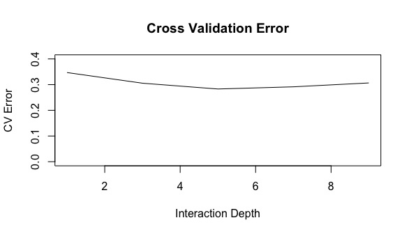
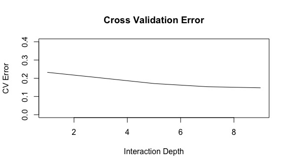
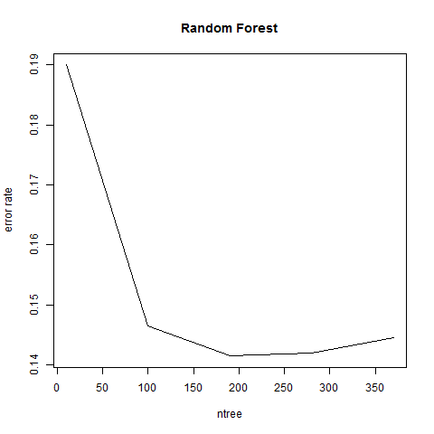
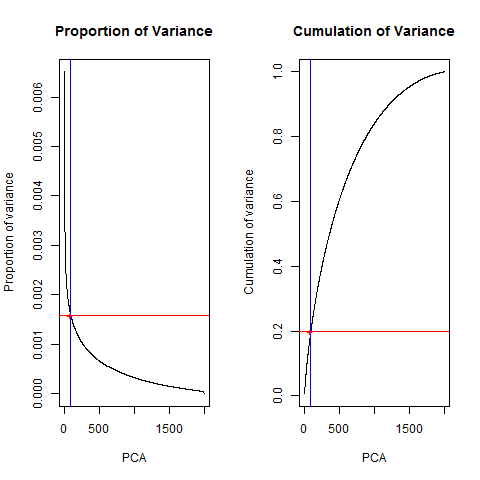
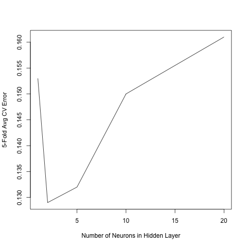

---
## **Project Description**

### Term
* Spring 2017

###Team 
* Group 8

### Team Members   
* Ken Chew  
* Yue Jin  
* Yifei Lin  
* Sean Reddy  
* Yini Zhang  

### Project Summary
* In this project, we implemented majority vote with Gradient Boosting Machine (GBM), Random Forest, Neural Network and Convolutional Neural Network (CNN) to generate a classification engine for grayscale images of poodles versus images of fried chickens. 
* To further improve the prediction performance, besides the provided SIFT descriptors, we also used Histogram of Oriented Gradients descriptors to train the model.

## **Baseline Model (GBM + Sift)**
Tuned Parameters are: Depth = 5

Methology: Cross Validation with different depth

Depth | Error Rate 
------------- | ------------- 
5 | 0.2355

## **Improved Model**
### Feature
* In addition to 5000 sift features, we used Histogram of Oriented Gradients (HOG) method to generate 448 extra new features   
* HOG + a feature descriptor used in computer vision and image processing for the purpose of object detection + it counts occurrences of gradient orientation in localized portions of an image + it is computed on a dense grid of uniformly spaced cells and uses overlapping local contrast normalization for improved accuracy

### Model 
* Majority Vote with GBM, random forest and neural network

### GBM
Tuned Parameters are: Depth = 5

Methology: Cross Validation with different Depth

Depth | Error Rate 
------------- | ------------- 
9 | 0.098

### Random Forest 
Tuned Parameters are: PCA_Threshold = 0.2, Num_tree = 300

Methology: Cross Validation with different PCA threshold and number of trees

PCA Threshold | Number of trees | Error Rate
------------- | -------------  | -------------
0.2 | 300 | 0.1

### Neural Network
Tuned Parameters are: Number of Hidden Layer = 3

Methology: Cross Validation with different Number of Hidden Layers

Number of Hidden Layer | Error Rate 
------------- | -------------  
3 |  0.135

### Convolutional Neural Network
Tuned Parameters are: Number of rounds = (), batch size = 50, learn rate = 0.01

Methology: Cross Validation with different Number of Round, Batch Size and Learning Rate

Number of Rounds | Batch Size | Learning Rate | Error Rate 
------------- | ------------- | ------------- | -------------  
() | 50 | 0.01 |  

### Majority Vote

